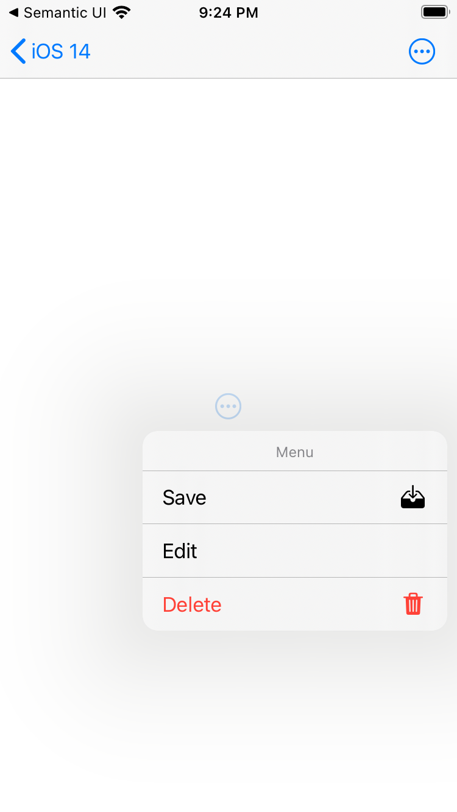
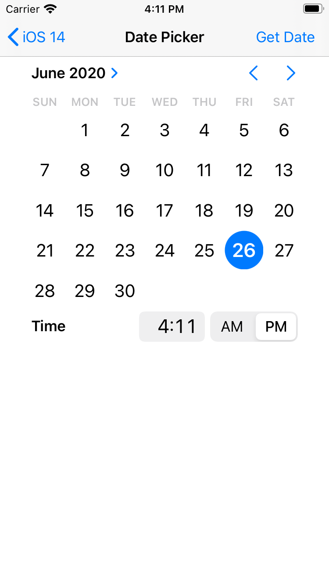

# iOS 14 Playground

Sample code and explorations of iOS 14.

## Pickers, Menus, and Actions

These samples correspond to the following WWDC 2020 sessions:

* [Build with iOS pickers, menus and actions](https://developer.apple.com/videos/play/wwdc2020/10052/) - Build iPhone and iPad apps with fluid interfaces and easily-accessible contextual information. We'll show you how to integrate the latest UIKit controls into your app to best take advantage of menus, date pickers, page controls, and segmented controllers.
* [Design with iOS pickers, menus and actions](https://developer.apple.com/videos/play/wwdc2020/10205/) - Create iPhone and iPad apps that look great and help people move quickly and directly to the information they need. Discover how you can integrate menus into your app for quick access to actions and settings, and learn where and when you should use them in your app. We'll also walk you through the new Date Picker and Color Picker controls, and show you how to integrate them into your app.

### UIMenus on UIButtons and UIBarButtonItems

<table>
    <tr>
        <td width="200">
            
        </td>
        <td>
            Add menus to `UIButton`s and `UIBarButtonItem`s by assigning a `UIMenu` object to those controls' `menu` property. By default, menus will appear after a long press on the button. You can also immediately show a menu by setting the `UIButton` property `showsMenuAsPrimaryAction` to `true`, or by not setting a primary action on `UIBarButtonItem`.
        </td>
    </tr>
</table>

### UIColorPickerViewController

<table>
    <tr>
        <td width="200">
            
        </td>
        <td>
            A built-in color picker view controller. In this demo, selecting a color in the color picker view controller changes the background color of its delegate view controller.
        </td>
    </tr>
</table>

### UIDatePicker

<table>
    <tr>
        <td width="200">
            
        </td>
        <td>
            The UIDatePicker control has received a major upgrade in iOS 14.
        </td>
    </tr>
</table>

